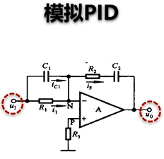

### 基本概念

所有的 PID 都可以归为模拟 PID 和数字 PID 两大类。  

- 模拟 PID 通过搭建控制电路实现的
- 数字 PID:通过编程实现
    
  PID 控制器在时间坐标下的连续表达式：  
    
  PID 控制器的离散表达式：  
    
  公式里的 △t 是一个常量，因此可以跟比例系数 Kp 和微分系数 Kd 合并，可以得到位置式 PID 算法的公式：  
    
  **当前时刻的位置式 PID-上一时刻的 PID，可以得到增量式 PID 的表达式：**  
    
    
    
  位置式 PID 和增量式 PID 本质上是同一个公式。

#### 各项含义

U = P + I + D

1. P = Kp\*(目标值-瞬时值)，单独调节无法达到目标值，而且会出现波动
2. I = Ki*[(目标瞬时值-目标值)+(上一秒的瞬时值-目标值)+...]*dt(时间间隔)
3. D = Kd\*[(目标值瞬时值-目标值)+(上一秒的瞬时值-目标值)]/dt(时间间隔)

4. Kp:更快达到目标值，在只有积分控制下，**会出现转速波动和稳态误差这两个问题**。
5. Kd:相当于一个阻尼器，转速远离目标值时，阻止远离。转速靠近目标值时，阻止靠近。**可以用于消除转速波动问题**。
6. Ki:用于消除稳态误差，根据积分控制部分的公式，当实际值小于目标值时，对这部分偏差进行正向积分，在积分的作用下，积分控制的输出变得越来越大，因此输出也变得越来越大。当实际值大于目标值时，对偏差部分进行负向积分，减小输出。**可以用于消除稳态误差问题**。
   想要实现的效果：快准稳。

#### ESP32 PWM 输出
